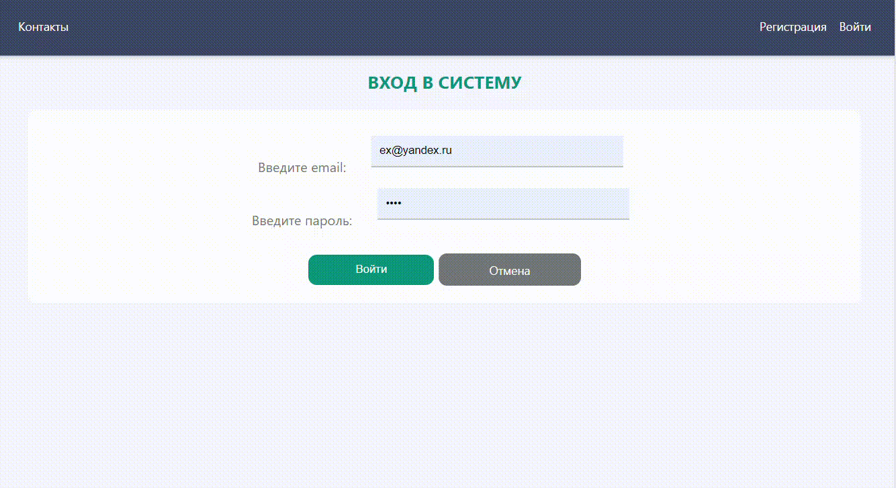

# Phonebook

### Stack
+ React
+ hooks
+ TypeScript
+ react-hook-form
+ react-router-dom
+ Redux
+ redux-thunk
+ reselect
+ CSS modules
+ NodeJs
+ json-server
+ json-server-auth
### Installation
1) Open terminal
2) On command line, type in the following commands:
```console
$ cd server
```
3) Install packages:
```console
$ npm install
```
4) Start application (server):
```console
$ npm start
```
5) Open terminal
6) On command line, type in the following commands:
```console
$ cd client
```
7) Install packages:
```console
$ npm install
```
8) Start application (client):
```console
$ npm dev
```
9) Open in browser: http://localhost:3000